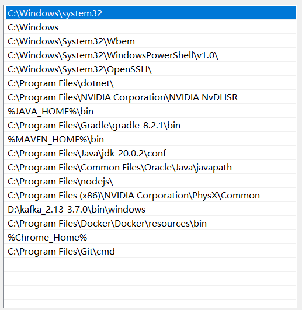

# Train Ticket Bot (TTB)

TTB is a console app that help you buy [train ticket](https://shuttleonline.ktmb.com.my/Home/Shuttle) 
between Woodland and Johor Bahru.

## Pre-requisite

You need to able to logon to [KTMB](https://online.ktmb.com.my/Account/Login)
with email and password combination.

## Installation

- you need to have at least java-17 installed, and added to system path.



- you need to have a chrome browser, and the chrome.exe dir is added to path.


## Configurations

## Usage

we need to externalize the configuration in order to use it, because there is a lot of personalized information. 
Define the configuration file in a location of your choice. e.g. D:\config\app.properties

```properties
email=
password=
PASSENGER1=
PASSENGER2=
PASSENGER3=
login_url=https://online.ktmb.com.my/Account/Login
shuttle_url=https://shuttleonline.ktmb.com.my/Home/Shuttle
port_0=1234
port_1=8989
port_2=7000
user_0_dir=D:/usrData2
user_1_dir=D:/usrData
user_2_dir=D:/usrData3
chrome_loc=

```

```bash
# To see definition of trips
java -jar ktmb-1.0.0.jar -help

```

```bash
# Real Booking usage
java -Dspring.config.location=path\to\your\config\file.properties -jar ktmb-1.0.0.jar -trips "4, 20 Oct 2024, 2015, y, M"

```

## Contributing

Pull requests are welcome. For major changes, please open an issue first
to discuss what you would like to change.

Please make sure to update tests as appropriate.

## License

[MIT](https://choosealicense.com/licenses/mit/)