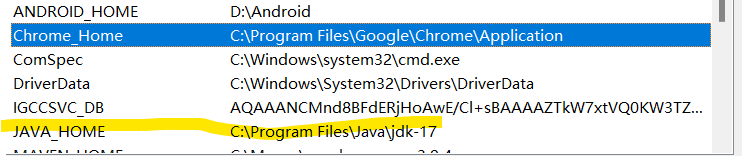

# Train Ticket Bot (TTB)

TTB is a console app that help you buy train ticket between Woodland and Johor Bahru.

## Installation

- you need to have at least java-17 installed, and added to system path.


- you need to have a chrome browser, and the chrome.exe dir is added to path.



## Usage

```bash
# To see definition of trips
java -jar ktmb.jar -help

```
- example
```bash
java -jar .\ktmb-1.0.jar -trips "4, 20 Oct 2024, 2015, y, M"

```

## Contributing

Pull requests are welcome. For major changes, please open an issue first
to discuss what you would like to change.

Please make sure to update tests as appropriate.

## License

[MIT](https://choosealicense.com/licenses/mit/)